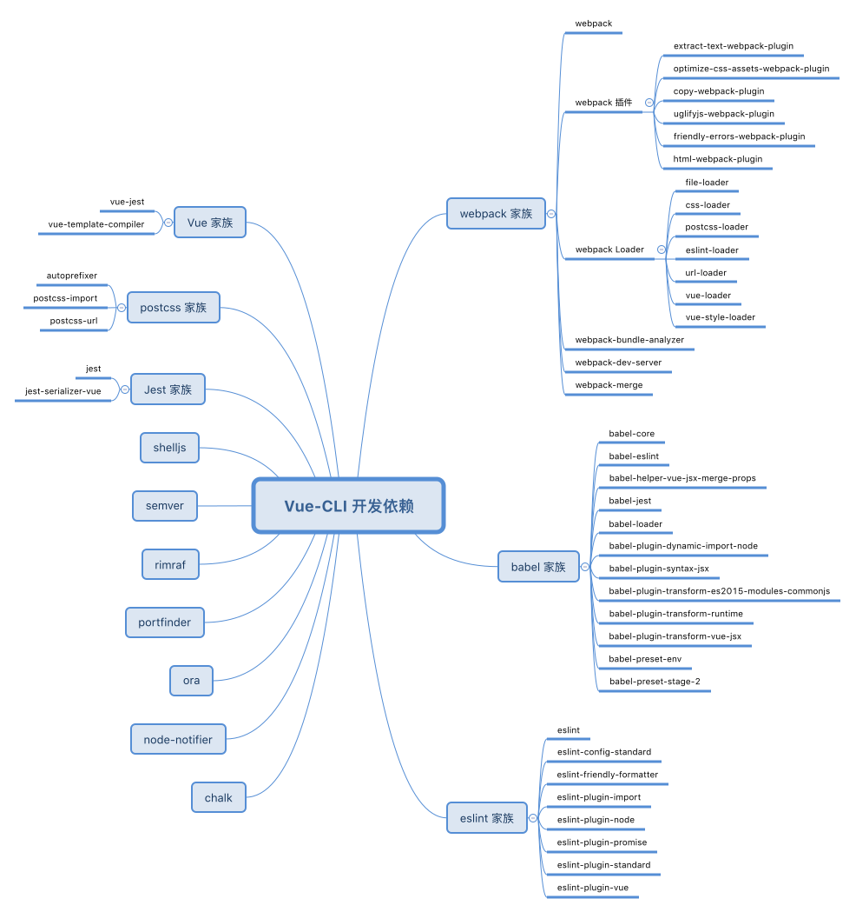

# 依赖分析

> 以下分析基于 `vue-cli v2.9.1`

使用 `vue init webpack my-project` 生成项目脚手架之后，查看 `package.json` 文件，可以看到，`devDependencies` 有很多项目，分类整理后如下所示：



> TODO: svg 图片太大 - 1.1MB，需要转换为 .png

下面从易到难，依次对其做简单介绍。

## node-notifier

[`node-notifier`][node-notifier] 是一个跨平台的原生消息提醒库。用法如下：

```js
const notifier = require('node-notifier')

notifier.notify('Message')

notifier.notify({
  title: 'My notification',
  message: 'Hello, there!'
})
```

## chalk

[`chalk`][chalk] 是一个终端文本样式库，可以设置终端字体的颜色、背景色、加粗、下划线等样式。用法如下：

```js
const chalk = require('chalk')
console.log(chalk.blue.bgRed.bold('Hello world!'))
```

## ora

[`ora`][ora] 是一个优雅的终端加载进度条。用法如下：

```js
const ora = require('ora')

const spinner = ora('Loading unicorns').start()

setTimeout(() => {
  spinner.color = 'yellow'
  spinner.text = 'Loading rainbows'
}, 1000)
```

## port-finder

[`portfinder`][portfinder] 在本机上查找可用的（空闲的）端口。用法如下：

```js
var portfinder = require('portfinder')

portfinder.getPort(function(err, port) {
  /** 此时的 port 肯定是空闲的可用端口 */
})

/** 若支持 Promise */
portfinder.getPortPromise()
  .then(port => {
    /** 得到一个空闲可用的端口 */
  })
  .catch(err => {
    /** 无法找到空闲可用端口号，err 是原因 */
  })
```

默认从 `8000` 开始查找，可以通过 `portfinder.basePort` 重新设定。

## rimraf

[`rimraf`][rimraf] 是一个 node 场景下的 `rm -rf`，即删除命令。用法如下：

```js
rimraf('some-thing', function(err, data){
  console.log('全部删除干净')
})
```

## semver

[`semver`][semver] 是 node 环境下的语义版本解析器。用法如下：

```js
const semver = require('semver')

semver.valid('1.2.3') // '1.2.3'
semver.valid('a.b.c') // null
semver.clean('   =1.2.3   ') // '1.2.3'
semver.satisfies('1.2.3', '1.x || >= 2.5.0 || 5.0.0 - 7.2.3') // true
semver.gt('1.2.3', '9.8.7') // false
semver.lt('1.2.3', '9.8.7') // true
semver.valid(semver.coerce('v2')) // '2.0.0'
semver.valid(semver.coerce('42.6.7.9.3-alpha')) // '42.6.7'
```

## shelljs

[`ShellJS`][shelljs] 是利用 Node.js API 实现的一套跨平台（Windows/Linux/OS X）的 Unix Shell 命令工具集。用法如下：

```js
var shell = require('shelljs')
 
if (!shell.which('git')) {
  shell.echo('Sorry, this script requires git')
  shell.exit(1)
}
 
// Copy files to release dir
shell.rm('-rf', 'out/Release')
shell.cp('-R', 'stuff/', 'out/Release')
 
// Replace macros in each .js file
shell.cd('lib')
shell.ls('*.js').forEach(function (file) {
  shell.sed('-i', 'BUILD_VERSION', 'v0.1.2', file)
  shell.sed('-i', /^.*REMOVE_THIS_LINE.*$/, '', file)
  shell.sed('-i', /.*REPLACE_LINE_WITH_MACRO.*\n/, shell.cat('macro.js'), file)
})
shell.cd('..')
 
// Run external tool synchronously
if (shell.exec('git commit -am "Auto-commit"').code !== 0) {
  shell.echo('Error: Git commit failed')
  shell.exit(1)
}
```

## REF

[node-notifier]: https://www.npmjs.com/package/node-notifier
[chalk]: https://www.npmjs.com/package/chalk
[ora]: https://www.npmjs.com/package/ora
[portfinder]: https://www.npmjs.com/package/portfinder
[rimraf]: https://www.npmjs.com/package/rimraf
[semver]: https://www.npmjs.com/package/semver
[shelljs]: https://www.npmjs.com/package/shelljs